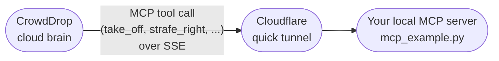

# Option B: bring your own MCP server

Prerequisite: [Step 1 - register your agent persona](../README.md#step-1-register-your-agent-persona-register_agent_personapy),
in the drone folder's README (one level up), if you haven't already.

You run your own [MCP](https://modelcontextprotocol.io/) server, and
CrowdDrop's cloud brain calls its tools directly - no subscribing to a
topic, no message broker involved at all.

**Not actually drone-specific.** Everything below happens to use a drone's
eight movement methods as the example, but nothing about this option
assumes a drone - the persona it creates has no built-in movement or
sensing at all. If you're building a humanoid, a ground vehicle, or
anything else, follow the exact same steps with your own action methods
instead of `take_off()`/`land()`/etc.



- **`dummy_robot.py`** - **start here.** A `RobotProtocol` subclass
  (`crowddrop_sdk.robot_protocol`) describing a dummy drone - this is the
  recommended shape for describing your own device, whatever it is (see
  "Describing your device with `RobotProtocol`" below).
- **`mcp_example.py`** - runs your MCP server, opens a tunnel to it, and
  registers it with CrowdDrop. Start here once you've verified it locally
  (Step B1 below).
- **`verify_mcp_locally.py`** - local-only stand-in for `mcp_example.py`:
  no tunnel, device key, or backend needed at all.

No Pub/Sub, no emulator, no topics - but your device now needs to be
*reachable* from CrowdDrop's cloud, which a NATed drone never is on its
own. `mcp_example.py` uses `crowddrop_sdk.mcp_tools.serve_and_register()`
to bridge that: it runs your MCP server locally, opens a Cloudflare quick
tunnel to it (no Cloudflare account needed), and registers the tunnel's
public URL with CrowdDrop - authenticated with the same device key
`../register_agent_persona.py` minted in Step 1. See `crowddrop_sdk`'s own README
("Registering an agent persona self-service" / "Alternative: bring your
own MCP server") for what each piece does individually.

**This folder is self-contained.** `mcp_example.py` and
`verify_mcp_locally.py` both use `dummy_robot.py`'s `DummyDrone` (the
eight movement methods, one parameterized example `move_to(lat, lon)`,
and the two required identity/status methods - see "Describing your
device with `RobotProtocol`" below) so you can see the whole thing work
before any real hardware is involved - this folder never needs anything
outside itself on disk (besides `../register_agent_persona.py` in Step 1). See
`dummy_robot.py`'s own docstring.

### Describing your device with `RobotProtocol`

**Recommended starting point for any device, not just this drone
example.** `crowddrop_sdk.robot_protocol.RobotProtocol` is a small `ABC`
you subclass - it's how we'd suggest starting *any* CrowdDrop agent
integration on this path, whatever your device actually is:

```python
from crowddrop_sdk.robot_protocol import RobotProtocol

class MyDevice(RobotProtocol):
    def identify_device_type(self) -> str:
        return "..."          # required

    def get_device_status(self) -> str:
        return "..."          # required

    def my_action(self) -> None:
        ...                   # add as many of these as your device needs
```

Two things this buys you over writing a plain `{name: function}` dict by
hand:

- **Real enforcement.** `identify_device_type()`/`get_device_status()`
  are `@abstractmethod` - Python refuses to instantiate a subclass that
  doesn't implement both (`TypeError: Can't instantiate abstract class ...`),
  instead of a persona silently missing them until an LLM tries to call one
  and gets a generic "tool not found" (see "Why these two methods
  specifically" below for what they're for).
- **No fixed vocabulary beyond those two.** Unlike Option A's Pub/Sub wire
  contract (a fixed eight-command vocabulary), `RobotProtocol` doesn't
  require or assume any particular action methods - add whatever your
  device actually does (`take_off`/`land` for a drone, `wave`/`speak` for
  a humanoid, `drive_to`/`honk` for a car, anything).

Every public method (not starting with `_`) on your subclass - the two
required ones and any you add - becomes an MCP tool once you pass an
instance through `command_handlers_from_robot()`:

```python
from crowddrop_sdk.robot_protocol import command_handlers_from_robot
from crowddrop_sdk.mcp_tools import build_command_mcp_server

server = build_command_mcp_server("my-device", command_handlers_from_robot(MyDevice()))
```

That's exactly what `mcp_example.py`/`verify_mcp_locally.py` do with
`DummyDrone` - `command_handlers_from_robot()` just turns your instance's
bound methods into the same `{name: callable}` dict
`build_command_mcp_server()` already accepts, so nothing about the wire
mechanism changes. **A plain dict still works too**, if you'd rather not
use a class - `RobotProtocol` is ergonomics and enforcement on top of the
same mechanism, not a new requirement.

### Writing a real action method

What a method's *body* should actually do (a real call into your flight
controller's SDK, a GPIO write, ...) is entirely up to your own hardware
integration code; see [`pubsub/README.md`'s "Reacting to a
command"](../pubsub/README.md#reacting-to-a-command) for a concrete
worked example (a MAVLink-based flight controller via `pymavlink`) if you
want a starting point - the method body itself doesn't know or care
whether it's being called as an MCP tool or a Pub/Sub command handler.
What's specific to exposing it as an *MCP tool* is this:

- **Arguments and return values both work, straight from your method's
  type hints.** `crowddrop_sdk.mcp_tools.build_command_mcp_server()` builds
  each tool's input schema from the handler's signature (`self` already
  excluded, since `command_handlers_from_robot()` hands it bound methods),
  so a parameterized method (e.g. `move_to(self, lat: float, lon: float)`)
  becomes a proper parameterized MCP tool with no extra wiring - see
  `dummy_robot.py`'s `move_to()` for a working example, and try it with
  `python verify_mcp_locally.py move_to lat=52.4 lon=13.0` (Step B1
  below). A return value is passed back to the caller as the tool's result
  content, the same way an exception (next bullet) is passed back as an
  error. The eight movement methods just happen to take no arguments and
  return nothing, since that's the fixed vocabulary Option A's Pub/Sub wire
  contract uses - MCP itself has no such restriction.
- **Raise on failure, don't just print/log.** An exception inside your
  method propagates back to CrowdDrop as a tool error - the LLM sees it
  and can react (e.g. narrate "battery too low to take off" back to the
  user instead of falsely confirming takeoff). A `print()`/`logger` call is
  only visible in your own process's output, never to CrowdDrop.
- **Add only the actions your hardware actually supports.** Beyond the two
  required `RobotProtocol` methods, there's no minimum set and nothing
  requires matching Option A's fixed vocabulary - describe your persona's
  real capabilities in `persona.yml`'s `persona_body` (Step 1,
  `register_agent_persona.py`'s persona definition) rather than claiming
  actions you haven't implemented.

Once your real subclass exists (in its own file, or wherever you keep your
hardware integration code - it doesn't have to live in `dummy_robot.py`),
point `mcp_example.py` at it instead:

```python
from my_drone_controller import MyRealDrone  # instead of: from dummy_robot import DummyDrone
...
command_handlers=command_handlers_from_robot(MyRealDrone()),
```

Everything else in `mcp_example.py` (the `serve_and_register()` call) stays
exactly the same - it's transport plumbing, not tool logic, and doesn't
change based on what your methods actually do.

### Why these two methods specifically

`identify_device_type()`/`get_device_status()` aren't an MCP convention -
CrowdDrop directs the LLM to call a tool named exactly
`identify_device_type` to answer "what are you," and one named exactly
`get_device_status` to answer "what's your status." A persona built with
a plain dict (not using `RobotProtocol`) that omits either name doesn't
crash - the LLM just gets a normal "tool not found" response when it
tries - but `RobotProtocol` turns that into a real, enforced requirement
at the point you write your subclass, which is why it's the recommended
way to start. `dummy_robot.py` implements both as simple, string-returning
examples:

```python
def identify_device_type(self) -> str:
    return "A crowddrop-sdk example drone (dummy hardware, no real flight controller)."

def get_device_status(self) -> str:
    return "battery: 100%, location: (52.4219, 13.0483), heading: 0"
```

A real implementation would query your actual hardware instead of
returning a fixed string - see [`pubsub/README.md`'s "Reacting to a
command"](../pubsub/README.md#reacting-to-a-command) for what that looks
like for a real flight controller. You're free to add other
identity/status-flavored methods under other names too; `identify_device_type`/
`get_device_status` only matter because CrowdDrop specifically looks for
those two names, not because MCP itself treats them specially. Neither is
called on a schedule - both are called only when the LLM decides to, so
this isn't a live telemetry feed a dashboard could visualize.

## Step B1: verify it locally first (no tunnel, device key, or backend needed)

```bash
pip install "crowddrop-sdk[mcp]>=0.3.0"
python verify_mcp_locally.py take_off
```
`verify_mcp_locally.py` starts the same MCP server `mcp_example.py` would,
skips the tunnel entirely, and connects to it directly on `localhost` with
a plain MCP client - the same protocol CrowdDrop's backend speaks. You
should see:
```
MCP server listening locally on port 8765 (no tunnel - this stays on your machine).
Tools discovered: ['backward', 'forward', 'get_device_status', 'identify_device_type', 'land', 'move_to', 'strafe_left', 'strafe_right', 'take_off', 'turn_left', 'turn_right']
Calling 'take_off'({})...
  -> would spin up the rotors and climb to hover altitude
Call completed (isError=False).
```
(Alphabetical, not the order they're defined in `dummy_robot.py` -
`command_handlers_from_robot()` collects them via Python's own
introspection, which returns members sorted by name.)

To see a parameterized tool call instead, pass `key=value` arguments after
the command name:
```bash
python verify_mcp_locally.py move_to lat=52.4 lon=13.0
```
```
Calling 'move_to'({'lat': 52.4, 'lon': 13.0})...
  -> would fly to (52.4, 13.0)
  -> now heading to (52.4, 13.0)
Call completed (isError=False).
```
The second `->` line is `move_to`'s return value, echoed back by the
client - the eight zero-argument commands above don't return anything, so
you won't see that line for them. `identify_device_type` and
`get_device_status` (see "Why these two methods specifically" above)
behave the same way - try `python verify_mcp_locally.py get_device_status`.

## Step B2: run it for real

Also needs the `cloudflared` binary on PATH - see
[Cloudflare's install docs](https://developers.cloudflare.com/cloudflare-one/connections/connect-networks/downloads/)
(no Cloudflare account needed for the quick-tunnel mode this uses), and
`python-dotenv` (`pip install python-dotenv`) for the `.env` auto-loading
described next - already pulled in if you installed this repo's top-level
`requirements.txt` instead of just Step B1's `crowddrop-sdk[mcp]`.

`DRONE_DEVICE_KEY` doesn't need exporting by hand - `mcp_example.py`
auto-loads it from `../.env` (`../register_agent_persona.py`'s output,
the drone folder's README, one level up, Step 1) on startup.

macOS/Linux (bash/zsh):
```bash
export DRONE_ID=<your drone's identifier - the config_key you registered>
export BACKEND_URL=<your CrowdDrop backend's base URL>
python mcp_example.py
```
Windows (PowerShell): same variables via `$env:VAR = "value"`.

This registers your tunnel's URL with CrowdDrop and then blocks - Ctrl-C to
stop (this also tears down the tunnel). `BACKEND_URL` is the backend's base
URL, not the token-vending endpoint Option A's `drone_implementation.py`
uses - this path calls `/agents/register_external_tools` on it instead.

---

Looking for the other option? See
**[Option A: Google Cloud Pub/Sub](../pubsub/README.md)**, or the
[drone folder's README](../README.md) for how the two compare.
