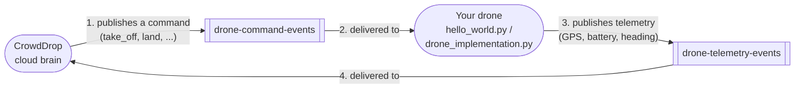
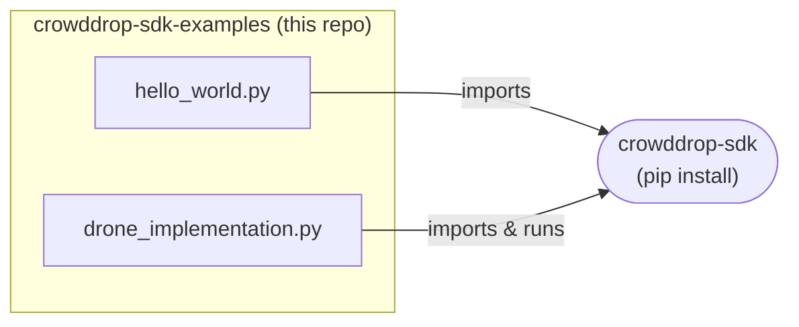

# Option A: Google Cloud Pub/Sub

Prerequisite: [Step 1 - register your agent persona](../README.md#step-1-register-your-agent-persona-register_agent_personapy),
in the drone folder's README (one level up), if you haven't already.

Two examples, plus small helper scripts for local testing:

- **`hello_world.py`** - the smallest possible working example. Start here.
- **`drone_implementation.py`** - a closer-to-real drone implementation:
  real authentication, a telemetry heartbeat, and the two integration
  points you'd actually fill in for real hardware.
- **`send_test_command.py`** - stands in for CrowdDrop's own backend, for
  local testing only. Publishes a single test command so you can watch
  either example above receive it without a real backend running.
- **`setup_emulator_topics.py`** - local-emulator-only, one-time: creates
  the topics/subscription the two examples above need. Not needed against
  real GCP, where CrowdDrop's own infra provisions these ahead of time.

## How this works

CrowdDrop's cloud brain and your drone never talk to each other directly -
they communicate through two Google Cloud Pub/Sub topics:



- **`drone-command-events`** - the cloud brain publishes a command
  (`take_off`, `land`, ...); your drone subscribes and receives it.
- **`drone-telemetry-events`** - your drone publishes GPS/battery/heading
  readings; the cloud brain subscribes and receives them.

That's why the helper scripts above exist: `send_test_command.py` plays the
role of the cloud brain box above (so you can see a command arrive without a
real backend running), and `setup_emulator_topics.py` creates the two topic
boxes on a fresh local emulator, since the emulator starts out empty - real
GCP doesn't need this, CrowdDrop's own infra provisions them ahead of time.

The local Pub/Sub emulator you start with Docker below stands in for the
Pub/Sub topics in the diagram, so you can see all of this working without a
GCP account or CrowdDrop credentials.

## Where the code actually lives

Both scripts here are thin - the actual Pub/Sub wiring, authentication, and
telemetry logic lives inside the `crowddrop-sdk` package you `pip install`,
not in this repo:



`drone_implementation.py` in particular doesn't add any logic of its own -
it just runs `edge_agent.py`, which ships inside `crowddrop-sdk`. That
means the two integration points you'd fill in for real hardware
(`handle_command`, `read_battery_and_gps`) aren't in this repo at all -
they're in that installed package. Find the file with:
```bash
python -c "import crowddrop_sdk.cloud_brain.drone.edge_agent as m; print(m.__file__)"
```
Edit it directly to wire up your flight controller and sensors, or copy it
into your own project as a starting point once you're past this example
stage.

## Step A1: `hello_world.py`

Publishes one telemetry reading, then listens for commands and turns each
one into a drone action - a dummy one, just a print, since there's no real
flight controller here. A command like `take_off` is only a string on the
wire; `crowddrop-sdk` has no idea what it means physically. Converting it
into an actual action is entirely your job, and that's the one thing this
example exists to show: one small function per command
(`take_off()`, `strafe_right()`, ...), dispatched by command name.

### The eight commands

This is the complete, fixed set of commands the cloud brain can send - the
same eight strings that appear in `DRONE_COMMANDS`
(`crowddrop_sdk.cloud_brain.events`), the source of truth `hello_world.py`'s
`COMMAND_HANDLERS` dict below has to match:

| Command | Meaning |
|---|---|
| `take_off` | Rise to a default hover altitude |
| `land` | Descend and power down |
| `forward` | Move forward one fixed step |
| `backward` | Move backward one fixed step |
| `strafe_left` | Move left one fixed step, without turning |
| `strafe_right` | Move right one fixed step, without turning |
| `turn_left` | Rotate (yaw) left by a fixed angle |
| `turn_right` | Rotate (yaw) right by a fixed angle |

None of the movement commands carry a distance/duration - each is one
fixed-size step. "Move forward a lot" is the cloud brain sending `forward`
repeatedly, not a bigger number on one message. This list won't grow
without a `crowddrop-sdk` release, since `COMMAND_HANDLERS` (and
`edge_agent.py`'s equivalent) has to be updated alongside it either way.

### Reacting to a command

In `hello_world.py`, `on_command` looks up the incoming command in
`COMMAND_HANDLERS`, a plain dict, and calls whichever function it maps to:

```python
def take_off() -> None:
    print("  -> would spin up the rotors and climb to hover altitude")

# ... one such function per entry in DRONE_COMMANDS ...

COMMAND_HANDLERS = {
    "take_off": take_off,
    # ... and so on for all eight commands
}

def on_command(event: DroneCommandEvent) -> None:
    print(f"Received command: {event.command!r} (sequence={event.sequence})")
    COMMAND_HANDLERS[event.command]()
```

Each function here only prints - replace the body of `take_off`,
`strafe_right`, and so on with whatever actually drives your hardware
(a call into your flight-controller SDK, a GPIO write, ...). That's the
entire integration surface: `crowddrop-sdk` hands you a `command: str`
that's already been validated against the eight known literals; what each
one *does* is 100% yours to define.

**Concretely, what does that call look like?** It depends entirely on your
hardware's own API - `crowddrop-sdk` has no opinion on it and doesn't ship
one. As a worked example (not a dependency this repo installs, and not
tested against real hardware - adapt it to your actual flight controller
and firmware), a [MAVLink](https://mavlink.io/)-based controller via the
third-party `pymavlink` package might look like:

```python
from pymavlink import mavutil

# Your own connection to the real flight controller - opened once, reused
# by every command function below.
_connection = mavutil.mavlink_connection("/dev/ttyACM0", baud=57600)
_connection.wait_heartbeat()

def take_off() -> None:
    _connection.mav.command_long_send(
        _connection.target_system, _connection.target_component,
        mavutil.mavlink.MAV_CMD_NAV_TAKEOFF,
        0,  # confirmation
        0, 0, 0, 0, 0, 0,
        10,  # target climb altitude in meters - hardcode a sane default, or read one from your own config
    )

def land() -> None:
    _connection.mav.command_long_send(
        _connection.target_system, _connection.target_component,
        mavutil.mavlink.MAV_CMD_NAV_LAND,
        0, 0, 0, 0, 0, 0, 0, 0,
    )

# ... one such function per command your hardware actually supports - you
# don't have to implement all eight; COMMAND_HANDLERS only needs entries
# for the ones you do.
```

If your flight controller isn't MAVLink-based, the shape is the same either
way - open whatever connection your hardware's SDK needs once (serial port,
GPIO handle, a manufacturer's own client library, ...), then call into it
from each command function.

### Run it against a local emulator (no GCP account needed)

1. Start a Pub/Sub emulator. Easiest via Docker, no `gcloud` CLI install
   needed (Docker Desktop on Windows works the same way).

   macOS/Linux (bash/zsh):
   ```bash
   docker run -p 8085:8085 gcr.io/google.com/cloudsdktool/cloud-sdk:emulators \
     gcloud beta emulators pubsub start --host-port=0.0.0.0:8085
   ```
   Windows (PowerShell or `cmd.exe`) - same command, no `\` line
   continuation (that's bash-only; PowerShell would otherwise try to run a
   program literally named `\`):
   ```powershell
   docker run -p 8085:8085 gcr.io/google.com/cloudsdktool/cloud-sdk:emulators gcloud beta emulators pubsub start --host-port=0.0.0.0:8085
   ```
   On an ARM machine (e.g. Apple Silicon, Windows on ARM) you'll see a
   `platform ... does not match the detected host platform` warning - it's
   harmless, Docker just emulates the image; the emulator still starts, a
   little slower.
2. In a second terminal, point everything at it and create the topics/
   subscription (one-time per emulator run - the emulator starts empty).

   macOS/Linux (bash/zsh):
   ```bash
   export PUBSUB_EMULATOR_HOST=localhost:8085
   export GCP_PROJECT_ID=hello-world
   python setup_emulator_topics.py
   python hello_world.py
   ```
   Windows (PowerShell):
   ```powershell
   $env:PUBSUB_EMULATOR_HOST = "localhost:8085"
   $env:GCP_PROJECT_ID = "hello-world"
   python setup_emulator_topics.py
   python hello_world.py
   ```
   You should see:
   ```
   Starting hello-world drone 'hello-world-drone'...
   Published telemetry: lat=0.0, lon=0.0, heading=0.0, battery=100.0%
   Listening for commands - Ctrl-C to stop.
   ```
3. In a third terminal (same two env vars set - repeat the `export`/`$env:`
   lines above in this terminal too, they don't carry over between windows):
   ```bash
   python send_test_command.py take_off
   ```
   The `hello_world.py` terminal should immediately print:
   ```
   Received command: 'take_off' (sequence=None)
     -> would spin up the rotors and climb to hover altitude
   ```
   That second line is `take_off()`'s dummy body - see "Reacting to a
   command" above for where that lives and how to replace it.

That's the whole loop. From here, the natural next step is
`drone_implementation.py` below.

### Run it against real GCP

Same `hello_world.py`, no code changes - just don't set
`PUBSUB_EMULATOR_HOST`, and make sure your environment has real GCP
credentials with access to the `drone-command-events`/
`drone-telemetry-events` topics. Run `../register_agent_persona.py` first (see
the drone folder's README, one level up, Step 1) to get your own
`DRONE_ID` and device key self-service - the topics themselves are
provisioned ahead of time by
CrowdDrop's own infra, not self-created. `hello_world.py` doesn't implement
the agent-device-key token exchange real hardware needs - that's what
`drone_implementation.py` below adds.

## Step A2: `drone_implementation.py`

The next step up from `hello_world.py` - the actual shape of a real drone
integration:

- **Real authentication** - when `DRONE_DEVICE_KEY`/`BACKEND_TOKEN_VENDING_URL`
  are set, it exchanges your device key for a short-lived GCP access token
  automatically (your drone never handles a GCP key file) and keeps
  refreshing it in the background. Unset, it falls back to ambient
  credentials - e.g. `PUBSUB_EMULATOR_HOST` for local testing, same as
  `hello_world.py`.
- **A telemetry heartbeat** - publishes GPS/battery/heading every 10
  seconds in the background, not just once.
- **Two integration points** - `handle_command` dispatches to the same
  shape of per-command dummy stand-ins `hello_world.py` uses (see
  "Reacting to a command" above), and `read_battery_and_gps` (reads your
  real sensors) is another clearly marked stand-in. Both live in the
  underlying `edge_agent.py` module. Run it as-is to see the wiring work,
  then fill them in for your hardware.

### Run it against the local emulator

Reuses the same emulator and topics as `hello_world.py` above - if it's
still running, skip straight to:

macOS/Linux (bash/zsh):
```bash
export PUBSUB_EMULATOR_HOST=localhost:8085
export GCP_PROJECT_ID=hello-world
export DRONE_ID=hello-world-drone
python drone_implementation.py
```
Windows (PowerShell):
```powershell
$env:PUBSUB_EMULATOR_HOST = "localhost:8085"
$env:GCP_PROJECT_ID = "hello-world"
$env:DRONE_ID = "hello-world-drone"
python drone_implementation.py
```
Send it a command the same way as before, in another terminal:
`python send_test_command.py take_off`. You'll see the same dummy action
`hello_world.py` prints, just via `logger.info` instead of `print` (this
file runs as a background process, so it logs rather than prints) - that's
expected, until you replace the per-command stand-ins in `edge_agent.py`
with real flight-controller calls.

### Run it against real GCP

`DRONE_DEVICE_KEY` doesn't need exporting by hand - `drone_implementation.py`
auto-loads it from `../.env` (`../register_agent_persona.py`'s output, the
drone folder's README, one level up, Step 1) on startup - needs
`python-dotenv` (`pip install python-dotenv`), already pulled in if you
installed this repo's top-level `requirements.txt`.

macOS/Linux (bash/zsh):
```bash
export DRONE_ID=<your drone's identifier - the config_key you registered>
export GCP_PROJECT_ID=<the CrowdDrop GCP project - ask CrowdDrop>
export BACKEND_TOKEN_VENDING_URL=<the token-vending URL - ask CrowdDrop>
python drone_implementation.py
```
Windows (PowerShell): same variables via `$env:VAR = "value"`.

`send_test_command.py`/`setup_emulator_topics.py` are local-testing-only
and have no real-GCP equivalent here - a real CrowdDrop backend sends
commands instead.

---

Looking for a different way to connect? See
**[Option B: bring your own MCP server](../mcp/README.md)**, or the
[drone folder's README](../README.md) for how the two compare.
